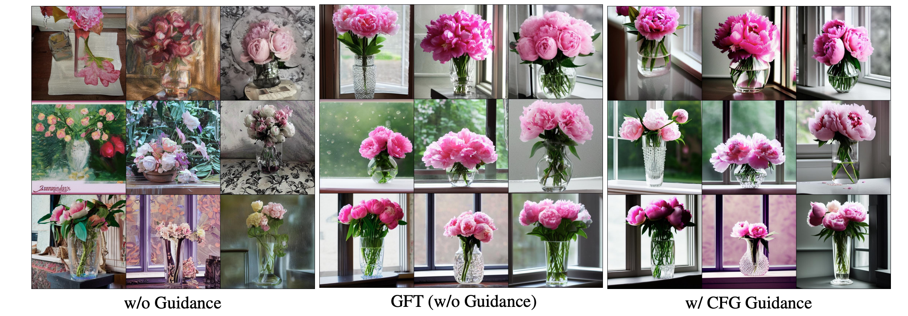

<div align='center'>
<h1>Guidance-Free Training (GFT) <br> Visual Generation Without Guidance </h1>

<h3>Huayu Chen<sup>†</sup>, Kai Jiang<sup>†</sup>, Kaiwen Zheng, Jianfei Chen, Hang Su, Jun Zhu</h3>
<h4><sup>†</sup>Co-first authors</h4>

<!-- TODO:  Thread,Paper,Dataset,Weights-->
[](https://arxiv.org/pdf/2501.15420)
</div>

<p align="center">
  
</p>

<p align="center">
  <b>Qualitative T2I comparison between vanilla conditional generation, GFT, and CFG on Stable Diffusion 1.5 with the prompt "Elegant crystal vase holding pink peonies, soft raindrops tracing paths down the window behind it".</b>
</p>

<p align="center">
  
</p>

<p align="center">
  <b>GFT allows us to adjust sampling temperature of visual generation, with only a single model.</b>
</p>

GFT is a simple algorithm that allows you to remove CFG from visual generative models without ANY performance loss.

- GFT is highly efficient, simply finetune your pretrained models for 1% pretraining time on the pretraining dataset.
- GFT requires minimal modifications (<10 lines of code) to existing codebases. Most design choices and hyperparameters are directly inherited from pretraining.
- GFT is highly universal. One algorithm fits ALL visual generative models. This includes diffusion/Flow/AR/Masked models.
- If you like, GFT also enables training guidance-free models directly from scratch.

Try GFT once, enjoy 50% cheaper guidance-free sampling forever!

Check out details in our [paper](https://arxiv.org/pdf/2501.15420).

<p align="center">
  
</p>

<p align="center">
  <b>Comparison of GFT and CFG method. GFT shares CFG's training objective but has a different parameterization technique for the conditional model. This enables direct training of an explicit sampling model.</b>
</p>

> **🔥 News!!!**
> - [2025/05] We release [training code](./DiT) and pretrained guidance-free [checkpoints](https://huggingface.co/aaa-ceku7/GFT/tree/main) of DiT models.
> - [2025/05] We release [training code](./stable-diffusion-v1-5) and pretrained guidance-free [checkpoints](https://huggingface.co/aaa-ceku7/GFT/tree/main/SD1.5-GF-finetune) of Stable Diffusion 1.5 models.
> - [2025/03] We release [training code](./LlamaGen) and pretrained guidance-free [checkpoints](https://huggingface.co/ChenDRAG/LLamaGen_GF/tree/main) of LlamaGen models.

## Usage
Please check out implementation and example usage in the respective directory of base models. See how GFT can be easily integrated into existing visual codebases.


## Citation
If you find our project helpful, please consider citing:
```
@article{chen2025visual,
  title={Visual Generation Without Guidance},
  author={Chen, Huayu and Jiang, Kai and Zheng, Kaiwen and Chen, Jianfei and Su, Hang and Zhu, Jun},
  journal={arXiv preprint arXiv:2501.15420},
  year={2025}
}
```
